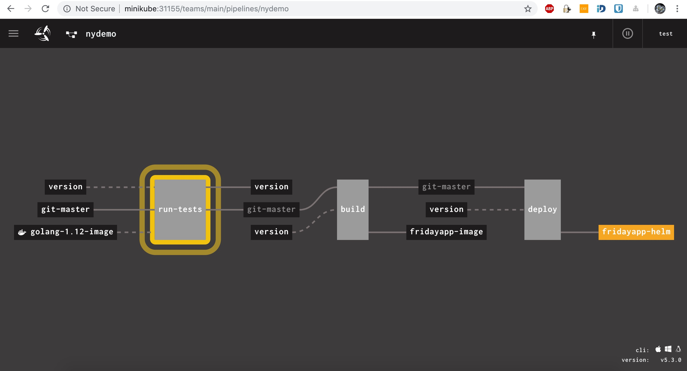
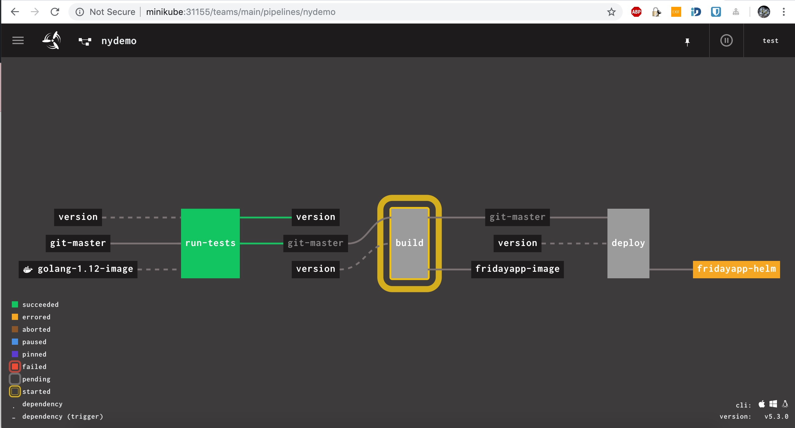
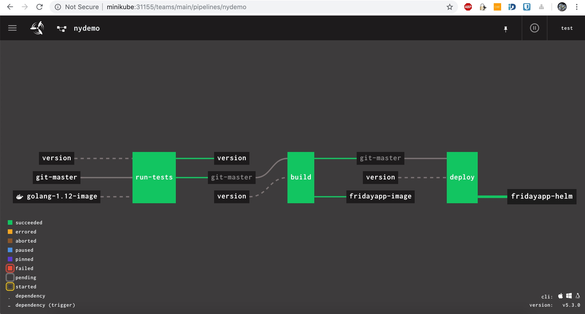

# NYDemo

## Disclamer
this is not something useful, just a DevOps style Hello World application setup with a number of limitations and ugly shortcuts.

## Project limitations
Set up avoids security topics - no RBAC provided, no accounts created in concourse (test credentials were used), no secret storage like Vault is used, no ImagePullSecret added to k8s etc<br/>
SSL is not configured anywhere<br/>
Provisioning of minikube was a requirement so the most natural 'hosting solution' for it was local VM provisioned with Vagrant<br/>
Because this is not supposed to be usefull in any way, Minikube persistent Volumes are not mounted from host machine so not persistent over vagrant recreations<br/>
Resulting UI are availabe on ad-hoc urls like `host:nonStandardPort` just because it didn't seem to be important. Automation was supposed to be kept as simple as possible, so some operations were done bash-script style, to avoid overcomplication and importing tons of third-party roles.

## Dependencies
To run the project latest [Vagrant](https://www.vagrantup.com/docs/installation/) and [Oracle Virtualbox]() should be installed. CI artifact is a docker image stored on Dockerhub, which means that to run the project one should either get permissions to push there or create own one and update application chart values.
Once vagrant is in place add the required plugins:
```
vagrant plugin install vagrant-disksize
```
and
```
vagrant plugin install vagrant-hostsupdater
```

## Description
This demo is a helloworld-ish application written in Golang, which renders an html template to a web page telling current weekday especially expressive on Fridays. The application has one function covered with unit-tests to make it possible to run a 'grown-up' CI pipeline. To make it happen some infrastructure is being set up:
Vagrant is launching a virtual machine and uses ansible playbook to provision Minikube, install helm, set up Concourse CI and configure CD pipeline inside of it.

## Running
### Pre-requirements.
This set up requires a valid github token [see here how to create one](https://help.github.com/en/articles/) allowed to push to this repo as version is tracked in version branch (creating-a-personal-access-token-for-the-command-line) and a Dockerhub account authorised to push to selected repository

### Step-by-step instructions
0. Install Vagrant and Virtualbox (instructions above) on a powerfull enough machine.
1. Clone this repository using whatever you prefer ssh:
```
git clone git@github.com:yar0slav/nydemo.git
```
or https:
```
git clone https://github.com/yar0slav/nydemo.git
```
2. Go to project directory:
```
cd nydemo
```
3. Give your credentials:
```
cp ci/credentials.yaml.dist credentials.yaml
```
and fill it with your data

4. If you've chosen to use your own Dockerhub repository, edit `helm/fridayapp/values.yaml` and edit repository subkey for image key with your repository.

5. Run automation:
```
vagrant up
```
and allow it to perform administrative tasks

6. Grab a coffee and let it do the magic - it might take a while depending on your connection speed and host system resources

7. Once everything's finished CI dashboard will be available under http://minikube:31155<br/>
Click on login and use `test` as login and password 

8. Concourse should find new code on Github and trigger the pipeline otherwise just click on run-tests bar and then on `+` in the upper right corner to trigger the pipeline. (Note, that all this setup has quite some virtualisation layers and concourse is using docker-engine heavily, so it may happen that CI will never finish due to hardware limitations)
Meanwhile you can watch pipeline running:


And finally when it's finished:


9. If you were lucky enough and CI has finished, you can enjoy the result under 
http://minikube:31000

10. When you're done, don't forget to remove file with your credentials:
```
rm -f ci/credentials.yaml
```
and destroy vagrant box to free computer power for something more useful:
```
vagrant destroy
```

11. Put you coffee cup into the dishwasher :)